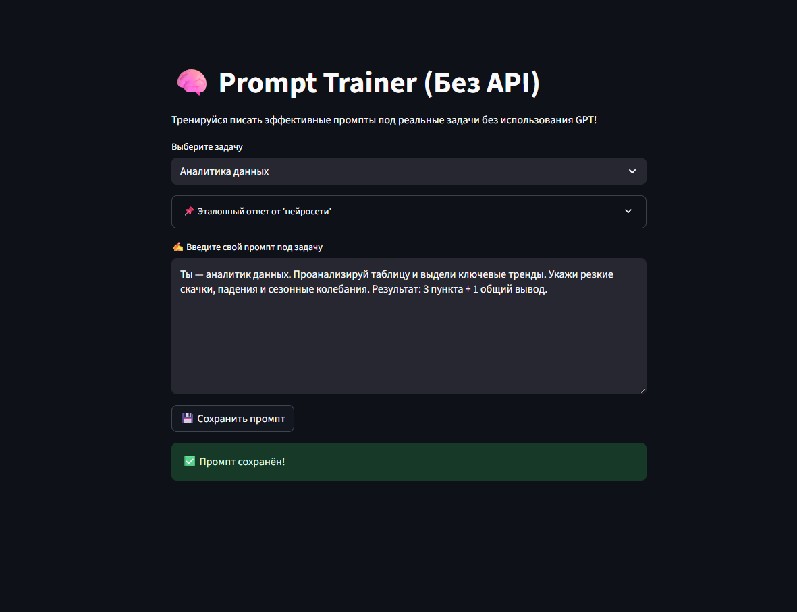

# 🧠 Prompt NoAPI Trainer

**Prompt NoAPI Trainer** is a training tool for practicing prompt writing without using GPT APIs or the internet.  
It's ideal for junior analysts, aspiring AI engineers, or anyone who wants to build **prompt engineering** skills locally.

---

## 🚀 Features

- ✅ CLI version (`prompt_trainer.py`) — interactive terminal prompt trainer with mock answers
- ✅ Web version (`streamlit_app.py`) — user-friendly Streamlit interface with logging
- ✅ Prompt library (`prompts.md`) — real-world task scenarios and templates
- ✅ Runs fully offline — no API keys or network connection required
- ✅ Perfect for portfolios, interviews, workshops, and learning LLM behavior

---

## 🖼 Interface Preview



---

## 📂 Project Structure

```
prompt-noapi-trainer/
├── prompt_trainer.py       # Terminal CLI version
├── streamlit_app.py        # Streamlit web app
├── prompts.md              # Tasks and prompt templates
└── README.md               # Project documentation
```

---

## 💻 Getting Started

1. Clone the repository:
```bash
git clone https://github.com/kalinnika/prompt-noapi-trainer.git
cd prompt-noapi-trainer
```

2. Install dependencies:
```bash
pip install streamlit
```

3. Run the web app:
```bash
streamlit run streamlit_app.py
```

Or run the CLI version:
```bash
python prompt_trainer.py
```

---

## ✍️ Example Use Cases

- 📊 Sales report summarization
- 🧠 Support request classification
- 👩‍💼 HR feedback analysis
- 📈 Business-style executive summaries
- 💡 Feature generation from user feedback

See more in [`prompts.md`](prompts.md)

---

## 🛠 Future Improvements

- [ ] Prompt evaluation and comparison to reference
- [ ] Token highlight feedback
- [ ] Scoring system / gamification
- [ ] Export prompts to JSON or Markdown

---

## 📜 License

MIT — free to use, fork, adapt and share.

---

## 🤝 Author

Created by [Nika Kalinnikova](https://github.com/KalinNika)  
This project was designed as a response to real employer requests in 2025:

> “Show us how you:
> - write task-specific prompts  
> - customize LLM behavior (system prompts, temperature)  
> - compare different models  
> - embed AI into real processes”

This is your answer. ✅
